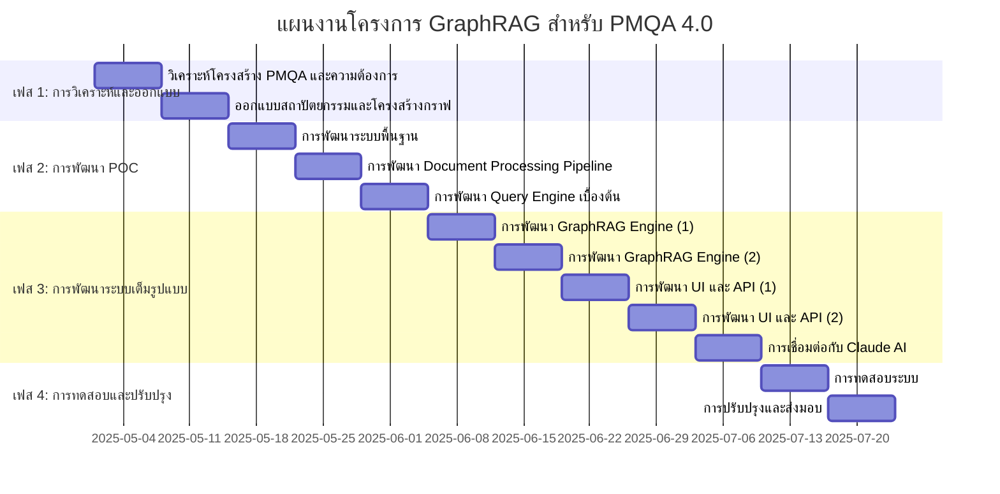

# Gantt Chart โครงการ GraphRAG สำหรับ PMQA 4.0

## คำอธิบายระยะเวลาโดยละเอียด

### เฟส 1: การวิเคราะห์และออกแบบ (2 สัปดาห์)
- **วิเคราะห์โครงสร้าง PMQA และความต้องการ**: 1-7 พฤษภาคม 2025
  - ศึกษาโครงสร้าง PMQA 4.0 โดยละเอียด
  - สำรวจและวิเคราะห์ประเภทเอกสารที่ต้องรองรับ
  - สัมภาษณ์ผู้ใช้เพื่อเก็บความต้องการ
  - เลือกเทคโนโลยีที่เหมาะสม

- **ออกแบบสถาปัตยกรรมและโครงสร้างกราฟ**: 8-14 พฤษภาคม 2025
  - ออกแบบ Database Schema สำหรับ Neo4j
  - ออกแบบโครงสร้างการจัดเก็บข้อมูลใน Vector Store
  - ออกแบบ API Endpoints
  - ออกแบบ UI Wireframes
  - ออกแบบ Document Processing Pipeline

### เฟส 2: การพัฒนา POC (3 สัปดาห์)
- **การพัฒนาระบบพื้นฐาน**: 15-21 พฤษภาคม 2025
  - ติดตั้ง Neo4j และ Chroma DB
  - สร้างโครงสร้างฐานข้อมูลเบื้องต้น
  - ติดตั้ง Ollama และโมเดลที่จำเป็น
  - สร้างโปรเจค Python และโครงสร้างโค้ดพื้นฐาน

- **การพัฒนา Document Processing Pipeline**: 22-28 พฤษภาคม 2025
  - พัฒนาระบบนำเข้าเอกสาร
  - พัฒนาระบบสกัดข้อความจากเอกสาร
  - พัฒนาระบบแบ่ง chunks และสร้าง embeddings
  - พัฒนาระบบวิเคราะห์และจัดหมวดหมู่ตาม PMQA

- **การพัฒนา Query Engine เบื้องต้น**: 29 พฤษภาคม - 4 มิถุนายน 2025
  - พัฒนา Cypher Queries สำหรับ Neo4j
  - พัฒนาระบบค้นหาด้วย Vector Similarity
  - พัฒนาระบบ Graph Traversal เบื้องต้น
  - ทดสอบประสิทธิภาพเบื้องต้น

### เฟส 3: การพัฒนาระบบเต็มรูปแบบ (5 สัปดาห์)
- **การพัฒนา GraphRAG Engine (1)**: 5-11 มิถุนายน 2025
  - พัฒนาระบบวิเคราะห์คำถาม
  - พัฒนาระบบค้นหาแบบไฮบริด
  - เริ่มพัฒนาระบบรวมผลลัพธ์

- **การพัฒนา GraphRAG Engine (2)**: 12-18 มิถุนายน 2025
  - พัฒนาระบบจัดอันดับผลลัพธ์
  - พัฒนาระบบสร้าง Context
  - ปรับแต่งประสิทธิภาพ

- **การพัฒนา UI และ API (1)**: 19-25 มิถุนายน 2025
  - พัฒนา API สำหรับการจัดการเอกสาร
  - พัฒนา API สำหรับการค้นหา
  - เริ่มพัฒนา UI สำหรับการจัดการเอกสาร

- **การพัฒนา UI และ API (2)**: 26 มิถุนายน - 2 กรกฎาคม 2025
  - พัฒนา UI สำหรับการค้นหา
  - พัฒนา UI สำหรับการแสดงผลลัพธ์
  - พัฒนาระบบการจัดการผู้ใช้

- **การเชื่อมต่อกับ Claude AI**: 3-9 กรกฎาคม 2025
  - พัฒนา API สำหรับเชื่อมต่อกับ Claude AI
  - พัฒนาระบบการสร้าง Prompt
  - พัฒนาระบบการประมวลผลคำตอบ
  - ทดสอบการเชื่อมต่อ

### เฟส 4: การทดสอบและปรับปรุง (2 สัปดาห์)
- **การทดสอบระบบ**: 10-16 กรกฎาคม 2025
  - ทดสอบการนำเข้าเอกสารจริง
  - ทดสอบการค้นหาและความแม่นยำ
  - ทดสอบประสิทธิภาพและการใช้ทรัพยากร
  - ทดสอบการใช้งานจริงกับผู้ใช้

- **การปรับปรุงและส่งมอบ**: 17-23 กรกฎาคม 2025
  - ปรับปรุงแก้ไขตามผลการทดสอบ
  - จัดทำเอกสารและคู่มือ
  - ฝึกอบรมผู้ใช้งาน
  - ส่งมอบระบบ