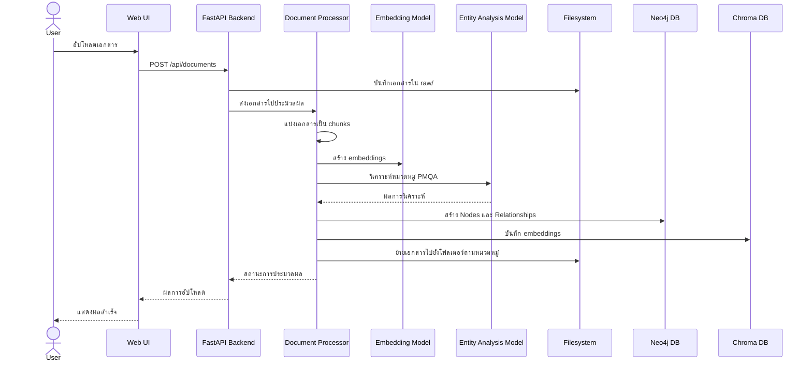
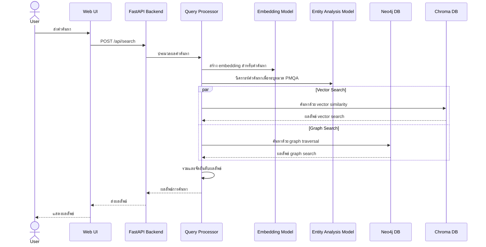
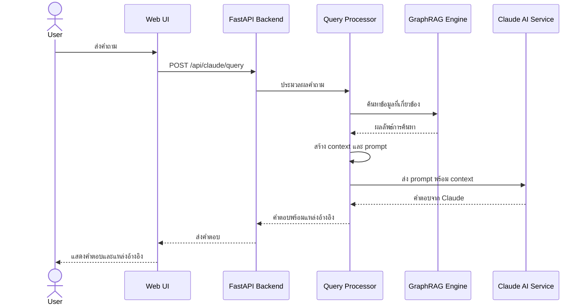

# สถาปัตยกรรมทางเทคนิค GraphRAG สำหรับ PMQA 4.0

## 1. ภาพรวมสถาปัตยกรรม

ระบบ GraphRAG สำหรับ PMQA 4.0 ถูกออกแบบให้เป็นสถาปัตยกรรมแบบ Microservices โดยแต่ละส่วนทำงานร่วมกันเพื่อสร้างระบบที่มีประสิทธิภาพในการจัดการข้อมูลและตอบคำถามเกี่ยวกับ PMQA

```
                     +-------------------+
                     |                   |
                     |  Web UI (Streamlit)|
                     |                   |
                     +--------+----------+
                              |
                              v
+------------------+  +-------+----------+  +-------------------+
|                  |  |                  |  |                   |
| Document Storage |<-| FastAPI Backend  |->| Claude AI Service |
| (Filesystem)     |  |                  |  |                   |
+------------------+  +-------+----------+  +-------------------+
                              |
                              v
              +---------------+---------------+
              |                               |
    +---------v---------+         +-----------v---------+
    |                   |         |                     |
    |   Neo4j Graph DB  |<------->|   Chroma Vector DB  |
    |                   |         |                     |
    +-------------------+         +---------------------+
              ^                             ^
              |                             |
    +---------+---------+         +---------+---------+
    |                   |         |                   |
    | Entity Analysis   |         |    Embedding      |
    | (Ollama - llama3) |         | (Ollama - nomic)  |
    +-------------------+         +-------------------+
```

## 2. องค์ประกอบหลักของระบบ

### 2.1 Document Storage
- **เทคโนโลยี**: Filesystem
- **หน้าที่**: จัดเก็บเอกสารต้นฉบับตามโครงสร้างที่สอดคล้องกับ PMQA 4.0
- **โครงสร้าง**:
  ```
  /documents
  ├── หมวด_1/
  ├── หมวด_2/
  ├── หมวด_3/
  ├── หมวด_4/
  ├── หมวด_5/
  ├── หมวด_6/
  ├── หมวด_7/
  └── raw/ (สำหรับเอกสารที่ยังไม่ได้จัดหมวดหมู่)
  ```

### 2.2 Graph Database
- **เทคโนโลยี**: Neo4j Community Edition
- **หน้าที่**: จัดเก็บโครงสร้างความสัมพันธ์ของข้อมูลตามเกณฑ์ PMQA
- **แผนภาพ Node และ Relationship**:
  ```
  (Category)-[:HAS_SUBCATEGORY]->(Subcategory)-[:HAS_CRITERIA]->(Criteria)
          ^                           ^                 ^
          |                           |                 |
          +---------------------------+-----------------+
                                      |
  (Document)-[:BELONGS_TO]------------+
       |
       +--[:HAS_CHUNK]-->(Chunk)
  
  (Document)-[:RELATES_TO]->(Document)
  ```

- **Node Properties**:
  ```
  Category {id, name, description}
  Subcategory {id, name, description, category_id}
  Criteria {id, name, description, subcategory_id}
  Document {id, title, path, mimetype, created_at, modified_at}
  Chunk {id, content, document_id, vector_id, start_idx, end_idx}
  ```

### 2.3 Vector Database
- **เทคโนโลยี**: Chroma DB
- **หน้าที่**: จัดเก็บ embeddings ของเอกสารและชิ้นส่วนของเอกสาร
- **คอลเลกชัน**:
  - `documents`: สำหรับเก็บ embeddings ของเอกสารทั้งฉบับ
  - `chunks`: สำหรับเก็บ embeddings ของชิ้นส่วนเอกสาร
- **Metadata ที่จัดเก็บ**:
  ```json
  {
    "document_id": "doc123",
    "chunk_id": "chunk456",
    "title": "รายงานประจำปี 2565",
    "category": "หมวด_1",
    "subcategory": "1.1",
    "criteria": "1.1.1",
    "path": "/documents/หมวด_1/รายงานประจำปี_2565.pdf",
    "start_idx": 1250,
    "end_idx": 1500
  }
  ```

### 2.4 Embedding Service
- **เทคโนโลยี**: Ollama + nomic-embed-text
- **หน้าที่**: สร้าง embeddings สำหรับเอกสารและชิ้นส่วนเอกสาร
- **คุณสมบัติ**:
  - ใช้ nomic-embed-text สำหรับ embeddings ภาษาอังกฤษ
  - ใช้ jeffh/intfloat-multilingual-e5-large-instruct สำหรับภาษาไทย
  - Dimension: 384 หรือ 768 (ขึ้นอยู่กับโมเดลที่เลือกใช้)
  - รองรับการทำ batch processing

### 2.5 Entity Analysis Service
- **เทคโนโลยี**: Ollama + llama3
- **หน้าที่**: วิเคราะห์เนื้อหาเอกสารเพื่อระบุความเกี่ยวข้องกับหมวดหมู่ PMQA
- **คุณสมบัติ**:
  - สามารถวิเคราะห์เอกสารและจัดหมวดหมู่ตามเกณฑ์ PMQA 4.0
  - สามารถสกัดคำสำคัญ (keywords) จากเอกสาร
  - สามารถระบุความสัมพันธ์ระหว่างเอกสาร

### 2.6 Backend API
- **เทคโนโลยี**: Python + FastAPI
- **หน้าที่**: ให้บริการ API สำหรับจัดการเอกสารและค้นหาข้อมูล
- **Endpoints หลัก**:
  ```
  POST   /api/documents             - อัปโหลดเอกสารใหม่
  GET    /api/documents             - ดึงรายการเอกสารทั้งหมด
  GET    /api/documents/{id}        - ดึงข้อมูลเอกสารเฉพาะ
  DELETE /api/documents/{id}        - ลบเอกสาร
  
  POST   /api/search                - ค้นหาด้วย hybrid search
  POST   /api/search/vector         - ค้นหาด้วย vector search
  POST   /api/search/graph          - ค้นหาด้วย graph search
  
  POST   /api/claude/query          - ส่งคำถามไปยัง Claude AI
  GET    /api/pmqa/structure        - ดึงโครงสร้าง PMQA
  ```

### 2.7 Web UI
- **เทคโนโลยี**: Streamlit
- **หน้าที่**: ให้ผู้ใช้สามารถจัดการเอกสารและค้นหาข้อมูลได้อย่างสะดวก
- **หน้าจอหลัก**:
  - หน้าอัปโหลดและจัดการเอกสาร
  - หน้าค้นหาข้อมูล
  - หน้าแสดงโครงสร้าง PMQA และความสัมพันธ์
  - หน้าถาม-ตอบกับ Claude AI

### 2.8 Claude AI Service
- **เทคโนโลยี**: Claude API
- **หน้าที่**: ให้บริการตอบคำถามโดยใช้ข้อมูลที่ได้จากระบบ GraphRAG
- **คุณสมบัติ**:
  - สามารถสร้าง prompt ที่เหมาะสมจากผลการค้นหา
  - สามารถอ้างอิงแหล่งที่มาของข้อมูล
  - รองรับการตอบคำถามภาษาไทยและภาษาอังกฤษ

## 3. กระบวนการทำงานหลัก

### 3.1 การนำเข้าเอกสาร


### 3.2 การค้นหาข้อมูล


### 3.3 การถาม-ตอบกับ Claude AI


## 4. โครงสร้างโค้ดและไฟล์

```
/hope_x1/
├── app/
│   ├── api/
│   │   ├── __init__.py
│   │   ├── documents.py
│   │   ├── search.py
│   │   └── claude.py
│   ├── core/
│   │   ├── __init__.py
│   │   ├── config.py
│   │   └── logging.py
│   ├── db/
│   │   ├── __init__.py
│   │   ├── graph_db.py
│   │   ├── vector_db.py
│   │   └── file_system.py
│   ├── models/
│   │   ├── __init__.py
│   │   ├── document.py
│   │   ├── pmqa.py
│   │   └── search.py
│   ├── services/
│   │   ├── __init__.py
│   │   ├── document_processor.py
│   │   ├── embedding_service.py
│   │   ├── entity_service.py
│   │   ├── graph_rag.py
│   │   └── claude_service.py
│   ├── utils/
│   │   ├── __init__.py
│   │   ├── text_splitters.py
│   │   └── metadata_extractors.py
│   ├── static/
│   ├── templates/
│   └── main.py
├── frontend/
│   ├── __init__.py
│   ├── app.py
│   ├── pages/
│   │   ├── __init__.py
│   │   ├── upload.py
│   │   ├── search.py
│   │   └── chat.py
│   └── components/
│       ├── __init__.py
│       ├── document_list.py
│       ├── search_results.py
│       └── chat_interface.py
├── data/
│   ├── pmqa_structure.json
│   └── documents/
│       ├── หมวด_1/
│       ├── หมวด_2/
│       ├── หมวด_3/
│       ├── หมวด_4/
│       ├── หมวด_5/
│       ├── หมวด_6/
│       ├── หมวด_7/
│       └── raw/
├── tests/
│   ├── test_document_processor.py
│   ├── test_search.py
│   └── test_claude_service.py
├── scripts/
│   ├── init_db.py
│   └── load_pmqa_structure.py
├── docs/
├── .env.example
├── docker-compose.yml
├── requirements.txt
└── README.md
```

## 5. การติดตั้งและการใช้งาน

### 5.1 ความต้องการของระบบ
- Python 3.10+
- Docker และ Docker Compose
- 24GB RAM ขึ้นไป
- พื้นที่เก็บข้อมูล 100GB+
- การเชื่อมต่ออินเทอร์เน็ต (สำหรับ Claude API)

### 5.2 ขั้นตอนการติดตั้ง
1. โคลนโปรเจคจาก repository
2. สร้างไฟล์ .env จาก .env.example และกำหนดค่าตามความเหมาะสม
3. รัน Docker Compose เพื่อติดตั้ง Neo4j และ Chroma DB
   ```bash
   docker-compose up -d
   ```
4. สร้าง Python virtual environment และติดตั้ง dependencies
   ```bash
   python -m venv venv
   source venv/bin/activate  # หรือ venv\Scripts\activate บน Windows
   pip install -r requirements.txt
   ```
5. รันสคริปต์เริ่มต้นเพื่อสร้างโครงสร้างฐานข้อมูล
   ```bash
   python scripts/init_db.py
   python scripts/load_pmqa_structure.py
   ```
6. รัน FastAPI backend
   ```bash
   uvicorn app.main:app --reload
   ```
7. รัน Streamlit frontend
   ```bash
   streamlit run frontend/app.py
   ```

### 5.3 การใช้งานขั้นพื้นฐาน
1. เข้าถึง UI ที่ http://localhost:8501
2. อัปโหลดเอกสารที่หน้า "อัปโหลดเอกสาร"
3. รอให้ระบบประมวลผลเอกสาร
4. ใช้หน้า "ค้นหา" เพื่อค้นหาข้อมูล
5. ใช้หน้า "ถาม-ตอบ" เพื่อถามคำถามกับ Claude AI

## 6. การขยายและปรับแต่งระบบ

### 6.1 การเพิ่มโมเดลใหม่
- ระบบออกแบบให้สามารถเปลี่ยนโมเดลได้ง่ายผ่านการแก้ไขไฟล์ config.py
- สามารถเพิ่มโมเดลใหม่ใน Ollama ได้โดยใช้คำสั่ง `ollama pull <model-name>`

### 6.2 การปรับแต่งประสิทธิภาพ
- ปรับขนาด chunk และค่า overlap
- ปรับจำนวน documents และ chunks ที่ดึงมาในแต่ละครั้ง
- ปรับจำนวน contexts ที่ส่งให้ Claude AI
- ปรับแต่งการใช้ cache เพื่อเพิ่มความเร็ว

### 6.3 การเพิ่มประเภทเอกสารใหม่
- ระบบรองรับการเพิ่ม document loaders สำหรับประเภทเอกสารใหม่
- สามารถเพิ่ม metadata extractors สำหรับประเภทเอกสารใหม่ได้